# Big Data Analytics: Customer Segmentation & Sales Analysis

## 📌 Project Overview

This project demonstrates the application of Big Data analytics methods to a real-world retail business scenario. Using the **Sample Superstore** dataset, we performed a full cycle of analysis — from data preparation and exploratory analysis to customer clustering and interactive dashboard creation.

The main objectives were:
- Identify profitable and unprofitable customer segments using **K-means clustering**
- Analyze the relationship between shipping modes and profitability
- Detect seasonal patterns in sales to support inventory and marketing planning

## 🛠️ Technologies Used

| Tool / Library | Purpose |
|----------------|---------|
| **Python 3.12** | Core programming language |
| **pandas** | Data loading, aggregation, cleaning |
| **scikit-learn** | StandardScaler, K-means clustering |
| **matplotlib / seaborn** | Data visualization |
| **Spyder** | Development environment |
| **Google Data Studio** | Interactive dashboard (KPI cards, filters, charts) |

## 📊 Dataset

**Source:** Sample Superstore (Tableau public dataset)  
**Format:** Excel (.xls → converted to .xlsx for analysis)  
**Size:** 10,194 rows, 21 columns  

**Key variables:**
- `Sales`, `Profit`, `Discount`, `Quantity`
- `Category`, `Segment`, `Region`, `State/Province`
- `Ship Mode`, `Order Date`, `Customer ID`

## 🔍 Methodology

### 1. Data Preparation
- Loaded data using pandas
- Checked for missing values and duplicates
- Aggregated data at customer level (804 unique customers)
- Removed outliers (99th percentile of sales)

### 2. Customer Clustering (K-means)
- Selected features: `TotalSales`, `OrderCount`, `AvgDiscount`, `ProfitPerOrder`
- Standardized features using `StandardScaler`
- Determined optimal k = 4 using the **Elbow method**
- Interpreted four customer segments

### 3. Visual Analytics
- Built 9+ visualizations in Python:
  - Sales by Category
  - Monthly Sales Trend with trend line
  - Sales by Region and State
  - Sales vs Profit by Ship Mode (dual-axis)
  - Scatter plot with correlation (r = 0.48)
- Created interactive dashboard in Google Looker Studio:
  - KPI cards (Total Sales: $2.33M, Total Profit: $292K, Avg Discount: 15.5%)
  - Time series, bar charts, scatter plot
  - Filters by Region and Category

## 📈 Key Findings

### Customer Segments (K-means, k=4)

| Cluster | Size | Avg Sales ($) | Avg Profit/Order ($) | Avg Discount | Interpretation |
|---------|------|---------------|----------------------|--------------|----------------|
| 0 | 278 | 1,608 | 60.60 | 10% | Loyal, stable margin |
| 1 | 238 | 3,294 | 26.49 | 16% | High sales, low profit |
| 2 | 98 | 6,925 | 209.12 | 11% | **VIP (most valuable)** |
| 3 | 181 | 1,520 | -34.28 | 27% | **Unprofitable (high discounts)** |

### Business Insights
- **Technology** category drives revenue ($839K), followed by Furniture ($755K)
- **Seasonal peaks** in September and November; positive annual trend (+12%)
- **Standard Class** shipping dominates (6,120 orders, $168K profit)
- Correlation between Sales and Profit: **r = 0.48** (moderate positive)

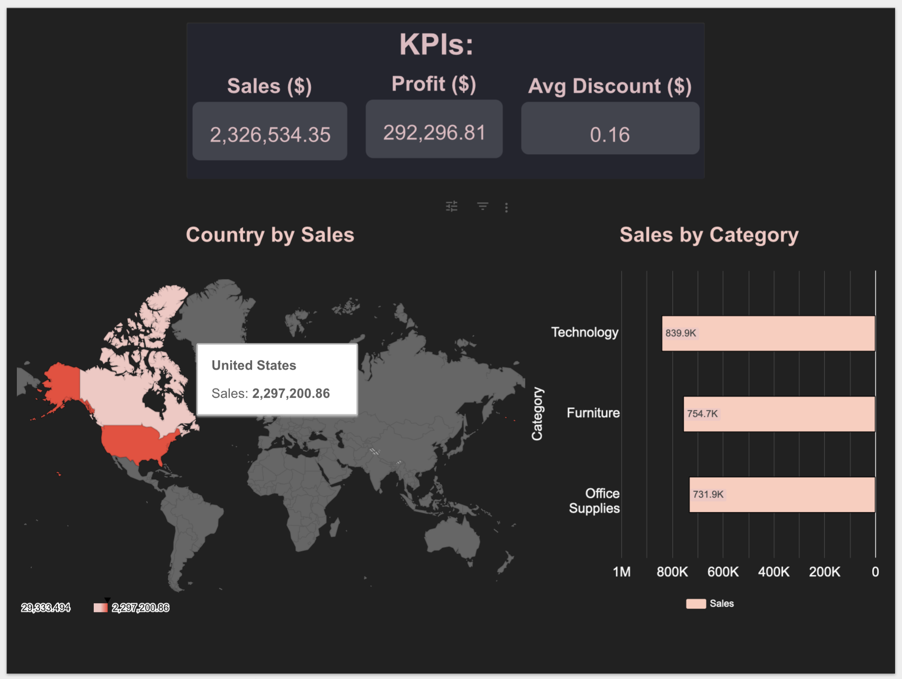

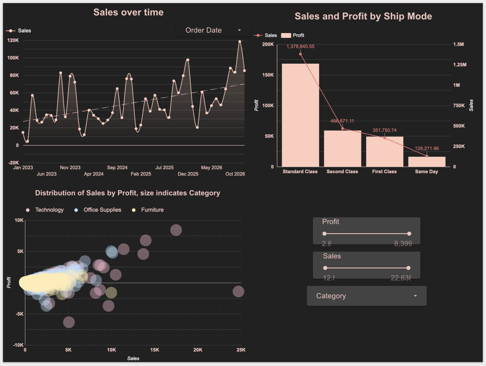

## 📁 Results
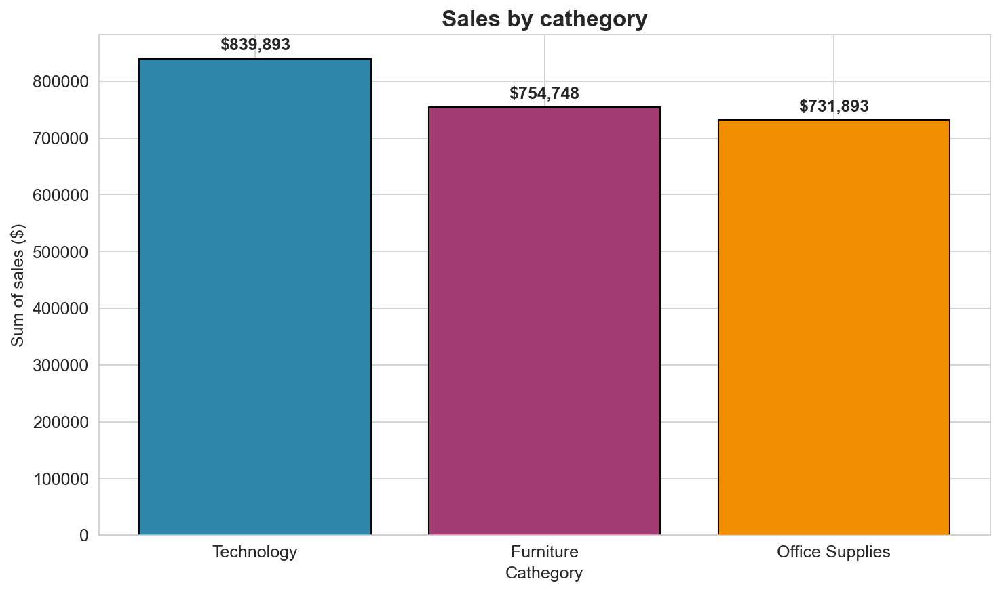
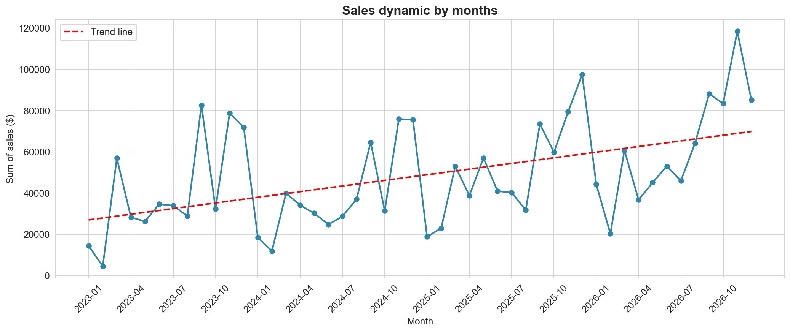
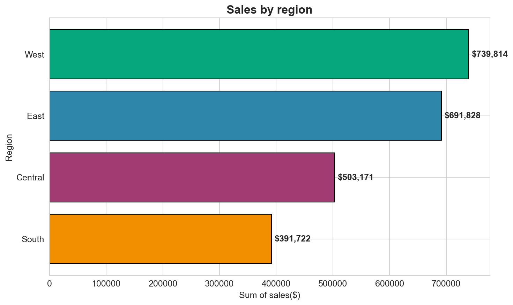
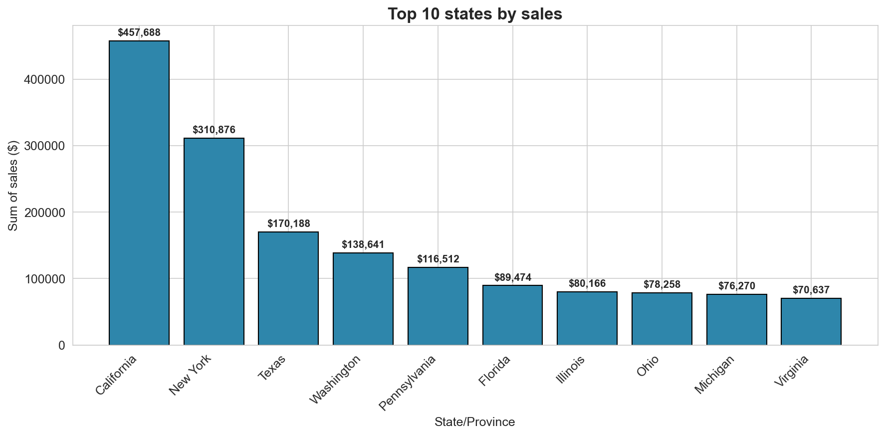
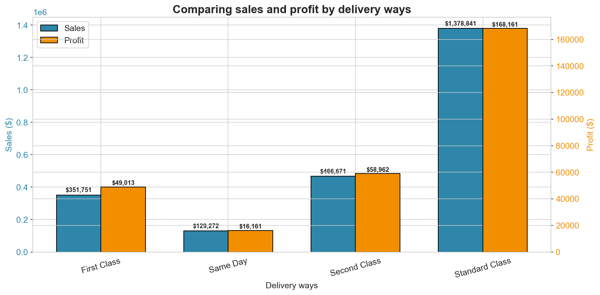
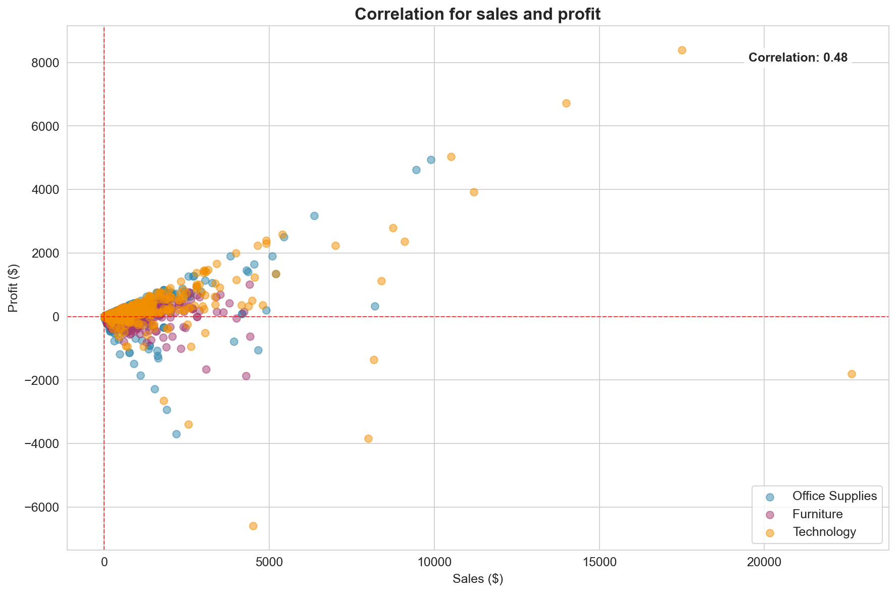
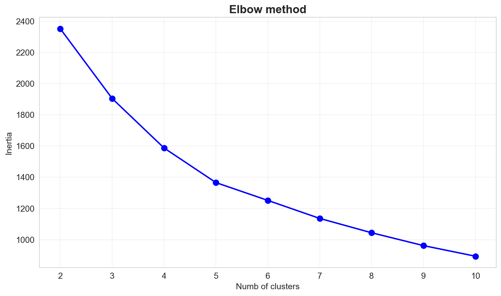
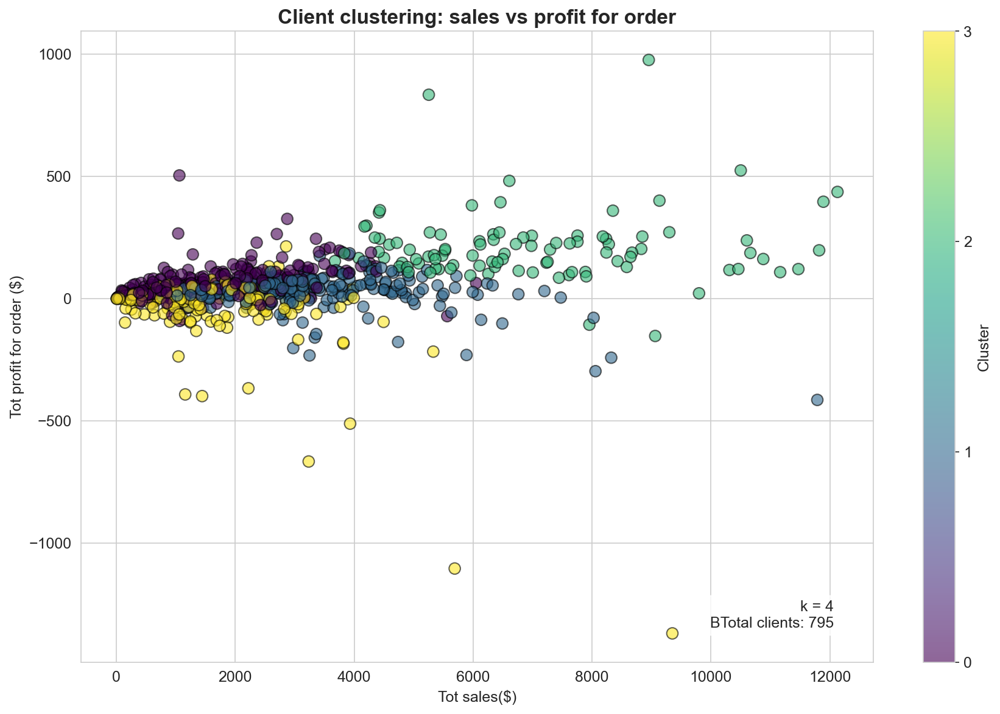
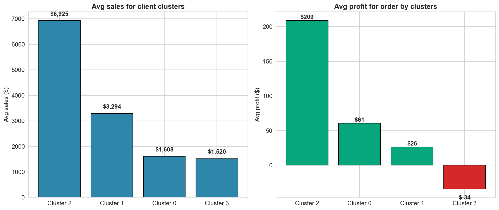
